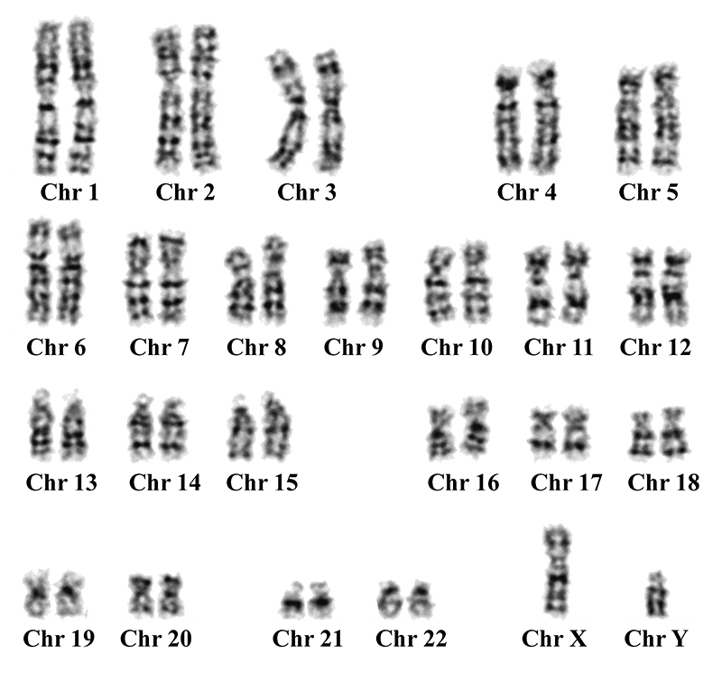
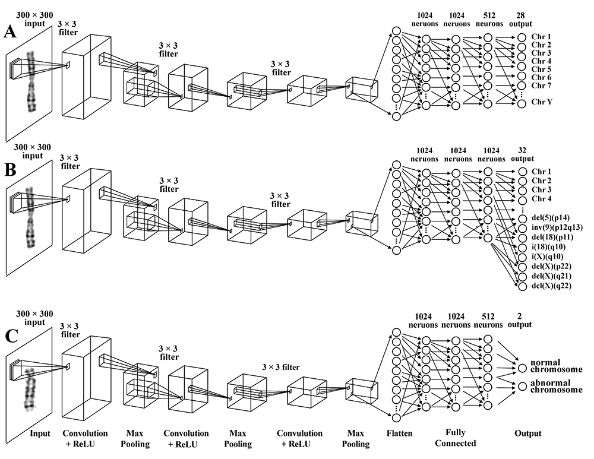

# Karoytyping Pinnacle: Deep Convolutional Neural Network
Chromosome Classification via Deep Learning Machine Applied in Patients with Structural Abnormalities of Chromosomes

***Chuan Yang*** (<yangc@sj-hospital.org>)

## Introduction
Karyotyping is an important procedure in cytogenetic practice for an early diagnosis of genetic diseases. The etiologies of many diseases originate from the abnormalities of karyotypes, such as leukemia, Down syndrome, simultaneous abortion, etc. So, the karyotype analysis is the basis and important reference for further diagnosis of genetics-related disease and preimplantation genetic diagnosis and screening. It has the advantages of ease of specimen aggregation and low testing costs. However, the clinical work of karyotyping is tedious, time-consuming, and sometimes error-prone, which is a heavy-load job even for an experienced cytogeneticist.

The objective of our study was to propose a novel DCNN-based model for automatically classifying both normal and abnormal chromosomes with the extracted chromosome images from patients, and an assessment was made to evaluate the performance of the model on a further translation of clinical practice, so that automatic classification of chromosomes is achieved to reduce the workload of chromosome karyotype analysts.

[](README.md)
[](README.md)


## Prerequisites
### Install the Scikit-learn
This option is only adopted by Python specialist. There are several dependencies necessarily preinstalled in your Python interpreter:

- **Scikit-learn**
```
$ pip install sklearn
 ```

 - **TensorFlow**
```
$ pip install tensorflow
 ```

## License
The MIT License (MIT)

Copyright (c) 2021 Chuan Yang

Permission is hereby granted, free of charge, to any person obtaining a copy
of this software and associated documentation files (the "Software"), to deal
in the Software without restriction, including without limitation the rights
to use, copy, modify, merge, publish, distribute, sublicense, and/or sell
copies of the Software, and to permit persons to whom the Software is
furnished to do so, subject to the following conditions:

The above copyright notice and this permission notice shall be included in all
copies or substantial portions of the Software.

THE SOFTWARE IS PROVIDED "AS IS", WITHOUT WARRANTY OF ANY KIND, EXPRESS OR
IMPLIED, INCLUDING BUT NOT LIMITED TO THE WARRANTIES OF MERCHANTABILITY,
FITNESS FOR A PARTICULAR PURPOSE AND NONINFRINGEMENT. IN NO EVENT SHALL THE
AUTHORS OR COPYRIGHT HOLDERS BE LIABLE FOR ANY CLAIM, DAMAGES OR OTHER
LIABILITY, WHETHER IN AN ACTION OF CONTRACT, TORT OR OTHERWISE, ARISING FROM,
OUT OF OR IN CONNECTION WITH THE SOFTWARE OR THE USE OR OTHER DEALINGS IN THE
SOFTWARE.

## Contributor List
- **Qiulei Dong** Ph.D., Professor, School of Artificial Intelligence, University of Chinese Academy of Sciences
