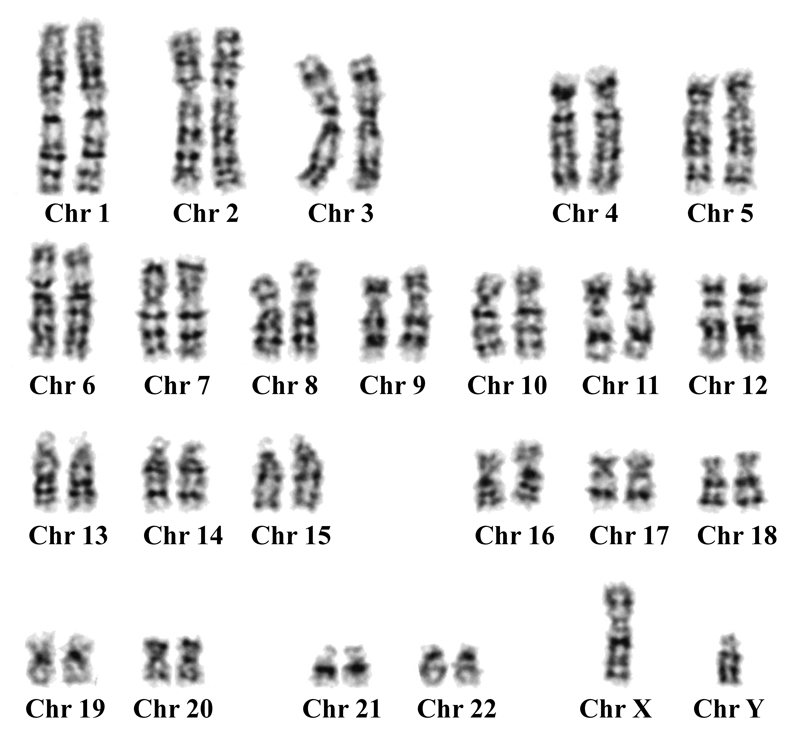

# Karoytyping Pinnacle
Chromosome Classification via Deep Learning Applied in Patients with Structural Abnormalities of Chromosomes

***Chuan Yang*** (<yangc@sj-hospital.org>)

## Introduction
Background and Objective: Karyotyping is an important technique in cytogenetic practice for the early diagnosis of genetic diseases. Clinical karyotyping is tedious, time-consuming, and error-prone. A few deep convolutional neural networks (DCNN)-based works have been proposed to classify structurally abnormal chromosomes in two sequentially pipelined stages. However, these two-stage methods are heavily dependent on the quality of extracted chromosome features, which could decline when the chromosomes are curved or bent. 

**Objective**: The objective of our study was to develop a single-stage DCNN-based model to automatically classify normal and abnormal chromosomes in an end-to-end manner. The model is also the first attempt to differentiate eight common structural abnormalities of chromosomes.

**Methods**: We analyzed 2,424 normal chromosomes and 544 abnormal chromosomes. The arrays of chromosome images were labeled as 32 classes including 24 classes of normal chromosomes (autosomal classes 1-22 and sex classes X or Y) and eight classes of abnormal chromosomes. A preliminary support vector machine (SVM) model was developed to evaluate the basic recognition performance on the dataset. A DCNN-based model was then proposed to process the same dataset. The metrics including accuracy, precision, recall, F1 score, and confusion matrix were calculated in the multi-class classifications and the receiver operating characteristic (ROC) curve to evaluate binary classifications. 


**Conclusions**: Our proposed DCNN-based model effectively performed the karyotype classification in an end-to-end manner. It had the competence to be used as a prediction tool for abnormal karyotype detection and screening in genetic diagnosis without initial feature extraction. We believe our work is meaningful for genetic triage management to lower the cost in clinical practice.

[](README.md)


## Prerequisites
### Install the Scikit-learn
This option is only adopted by Python specialist. There are several dependencies necessarily preinstalled in your Python interpreter:

- **Scikit-learn**
```
$ pip install sklearn
 ```

 - **TensorFlow**
```
$ pip install tensorflow
 ```

## License
The MIT License (MIT)

Copyright (c) 2021 Chuan Yang

Permission is hereby granted, free of charge, to any person obtaining a copy
of this software and associated documentation files (the "Software"), to deal
in the Software without restriction, including without limitation the rights
to use, copy, modify, merge, publish, distribute, sublicense, and/or sell
copies of the Software, and to permit persons to whom the Software is
furnished to do so, subject to the following conditions:

The above copyright notice and this permission notice shall be included in all
copies or substantial portions of the Software.

THE SOFTWARE IS PROVIDED "AS IS", WITHOUT WARRANTY OF ANY KIND, EXPRESS OR
IMPLIED, INCLUDING BUT NOT LIMITED TO THE WARRANTIES OF MERCHANTABILITY,
FITNESS FOR A PARTICULAR PURPOSE AND NONINFRINGEMENT. IN NO EVENT SHALL THE
AUTHORS OR COPYRIGHT HOLDERS BE LIABLE FOR ANY CLAIM, DAMAGES OR OTHER
LIABILITY, WHETHER IN AN ACTION OF CONTRACT, TORT OR OTHERWISE, ARISING FROM,
OUT OF OR IN CONNECTION WITH THE SOFTWARE OR THE USE OR OTHER DEALINGS IN THE
SOFTWARE.

## Contributor List
- **Qiulei Dong** Ph.D., Professor, School of Artificial Intelligence, University of Chinese Academy of Sciences
